# Outline of project develop 

## Initial thoughts/ideas

While my research presentation was centred on Cecil Richards, who predominantly produces work using Bitsy, I feel like I want to develop a major project that helps me to practice my coding skills. Richards' work, perhaps then, inspires me in terms of its dealings with a fraught sense of nostalgia for a childhood and innocence lost in a time of rapidly shifting socio-cultural and political worldviews. 

Aesthically, I feel inspired by [Tarako Gorge](https://nickm.com/taroko_gorge/). Reflecting on the poem, I was reminded of natural and unatural systems, including railway lines, a perninent motif in much of my work. While aesthically adopting ideas from Tarako Gorge, I'm keen to make my work narrative based, like Richards' and non-generative. Instead, I think I'll centre mine on a auto-biographical poem which looks at a morning on the railway with my father. This will let me tackle the links between/trouble some big picture issues: 

- colonialisation and the minerals industry
- domestic violence, sexism and lock-room culture
- the habituation of masculinity in a rural context
- and the links between land violence and patriarchy

I already have a few works in mind that with some modification might be ideal for this project, but only time will tell. I like the idea of creating something with a larger thematic thread, which is driven tonally either through visuals, audio or some minor interactive elements. I'm keen to incorporate a voice over as I'm interested in investing in spoken-word spaces. I also like the idea of incorporating music/sound effects and some photography.  

## Initial project sketches

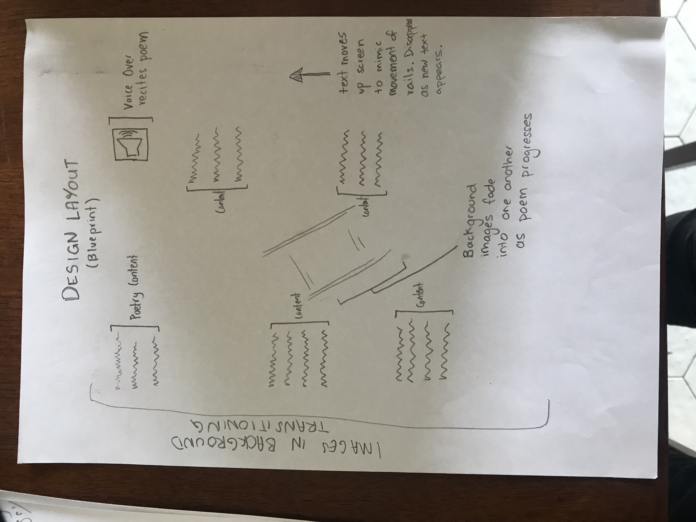

## Initial project ideas

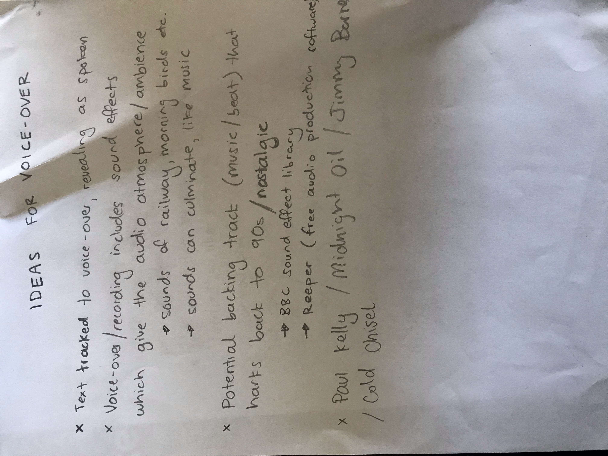
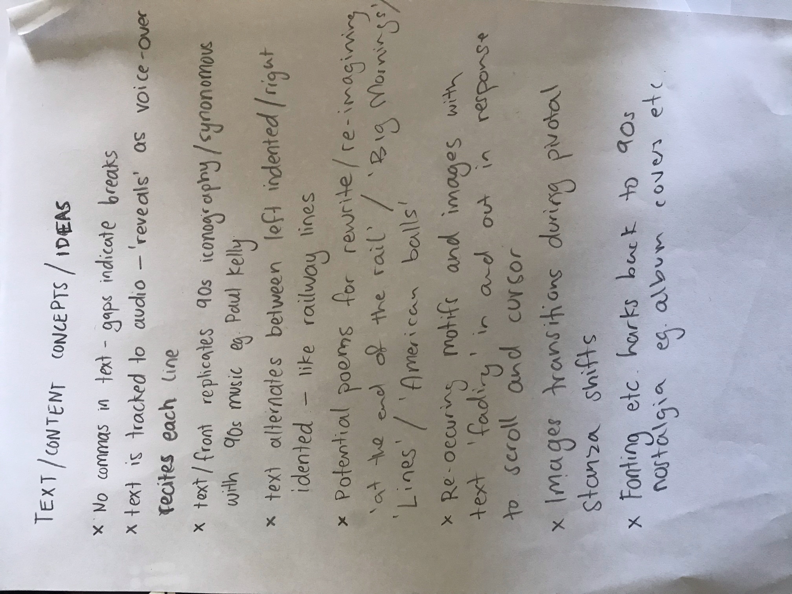

## Intial mock-up for presentation

# Critical feedback from workshopping

Ben raised some concerns about the scope of my project. Questions include: 
- are there too many moving parts? 
- is the work, in all, too technically complex to complete within the deadline?
- Am I biting off more than I can chew? 
- is the work aesthetically overwhelming for the reader? ie. with fading images as well as synced audio and text, will the reader be able to follow the movement of the piece? 
- how difficult will it be to sync text with audio with images? is this technically too adventurous? 

Ben also suggested adding an 'entry button' so that the poem doesn't begind automatically (potentially difficult coding-wise). He also said that he felt this project might work in gallery spaces——which is exciting, and something I hadn't totally considered.  

Charles asked where I planned to source materials, such as soundbites/effects/music and images, as well as some source coding. 
Other students wondered whether I'd have time to complete a project of this magnitude. 

## Response/reflection on feedback

Overall, the class seemed impressed with the complexity of my project, as well as its current stage of development. 
I believe, in terms of skill development and materials acquisition, I should be okay, but need to remain vigilant during project development, potentially scaling back if necessary. As Ben outlined, syncing text with audio will likely be time intensive, as I may have to do this line by line. He did, kindly, however, put me onto howler.js

In terms of whether the work will be 'too overwhelming' or 'distracting' (because of the multiple moving parts), only time will tell I suppose. As I develop 'mock-ups' I think it's important to keep this in mind, and to, again, scale back if necessary (will a place-holding image do? Is this more powerful?)

I'm excited by the prospect of developing the work with a future gallery space in mind. With all the incporated media elements, as well as the 'big-picture' aesthetic, I think it could really work, driving my inspiration for the project.  

## Offering feedback to pitches

I was particularly impressed with both Charles and Lauren's major projects. Outside of class, I spoke to them both directly. Below is an outline of my thoughts: 

### Charles

I find Charle's work subversive, politically-charged and visually sardonic, and could immediately see applications beyond digital journals or spaces where digital literature might be traditionally published. Certainly, I'm concerned about how it might be 'read' (potentially offensive or inflamatory) but feel the work could be modified for commercial and educational purposes, particularly in educating young men on gender discourse (as space I write in often). During worhsopping, I told Charles I felt this work was a balancing act—that he'd have to turn the sarcasm up a notch so that the work can't be used to encourage INCELS and the like (the opposite to the desire effect) 

### Lauren's feedback

Lauren's work is refreshingly inventive; what a brilliant idea to subvert our expextations by incororating poetry into spam-ads, by offering a little bit of beauty in an otherwise frustrating poop-up. All the while, Lauren's work challenges some big-picture issues: 'fat-shaming' and 'dieting culture'. I told Lauren that beyond social commentary, and beyond literary journals and online arts' space, I felt her work could be used by the likes of writing orgs eg. imagine a Melbourne Writer's Festival or The Wheeler Centre incorprating this 'spam' into their website, essentially laying easter-eggs for avid literary fans. My major concern, which I raised in class as well as afterwards, was that her work might legitimately be confused for spam; would the average person follow what appears to be a spam link? I suggested really 'hamming up' the the copywriting on the spam link, to make it abundantly clear that there is exciting literary work beyond it. 

#### Overall reflection

Many styalistic and conceptual ideas raised during pitches (as well as the earlier practictioner presentations) made me think more broadly about digital literature, and what can be done. This seems, in so many ways, a space that can challenge language itself——and how we might create meaning on a fundamental level. When works are interactive yet narrative-based, who is the artist/writer? What differentiates art from poetry, and can a work be both installation and literature? 

I was impressed by the overall ingenuity of my classmates. They're all really commited to experimenting in this space. For those choosing more 'narrative routes' (many working with Twine), I'm slightly concerned about the scope of their projects——which I raised, along-side Ben, during class. It is nice, however, to see the coalescing of genres, forms, ideas. It also seems that many students, unsurpringly, are keen to tackle big issues, such as race, colonisation and gender discourse.

### new mock-up of entry button

As advised by Benjamin's feedback, I now feel that a start button is necessary. Below is a quick mock-up or potential ideas:

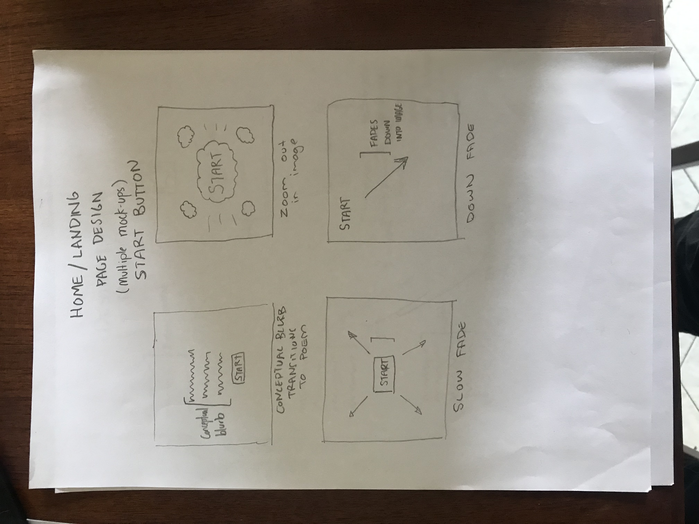

## Development processes

In discussing the project with Benjamin Laird, my tutor, he offered a base template for the work via glitch: https://sedate-octagonal-grasshopper.glitch.me. This base templated was derived from his poem [Core Values](https://poetry.codetext.net/core-values/). I then used this work to develop my work, as the piece has the 'unfurling' quality I was after. 

Similarly, in relaying concerns regarding audio syncing, Benjamin suggested using audio sunc through howl.js: https://glitch.com/edit/#!/audio-example-with-howler

### Rough notes on processes

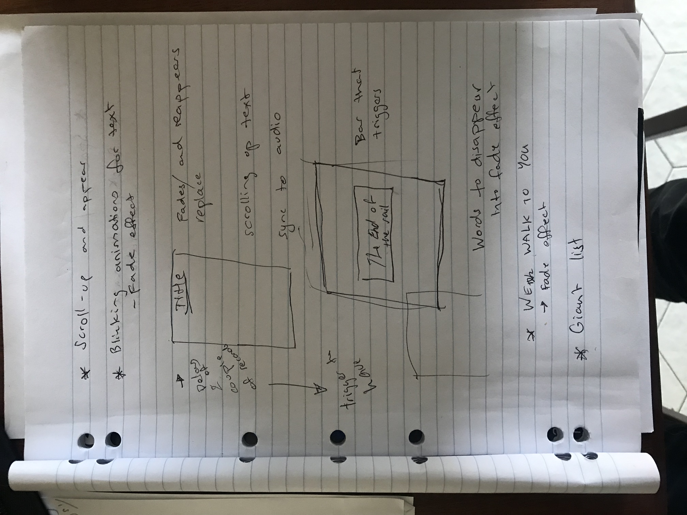
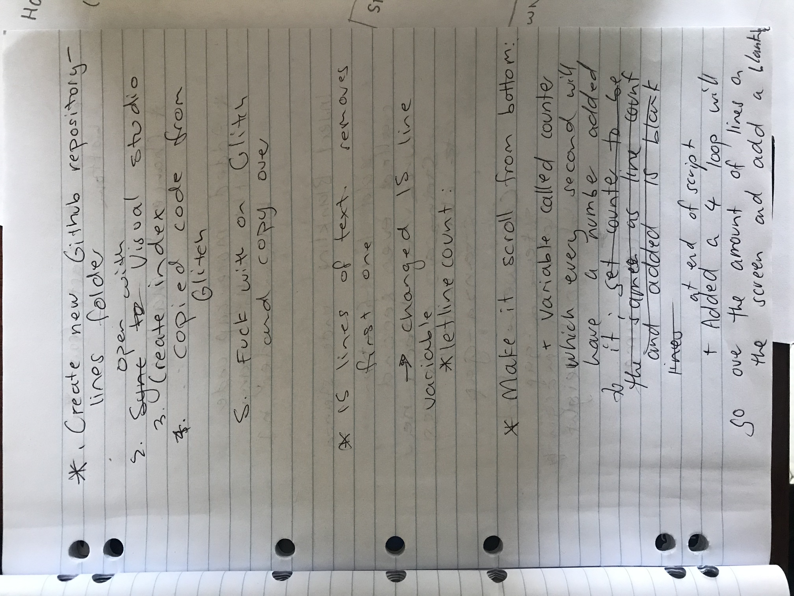
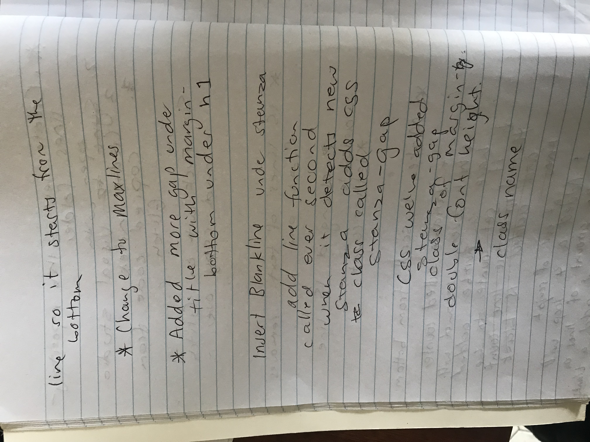
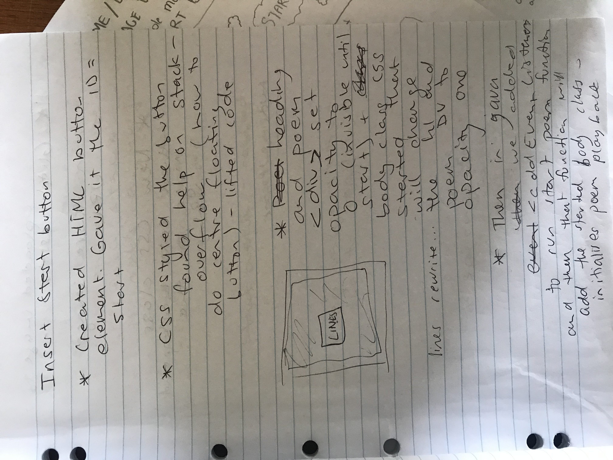
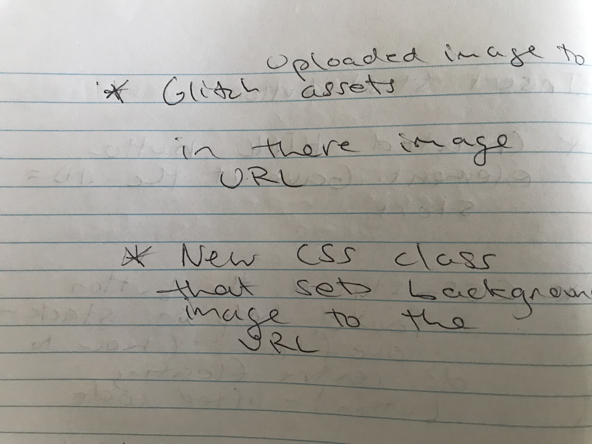
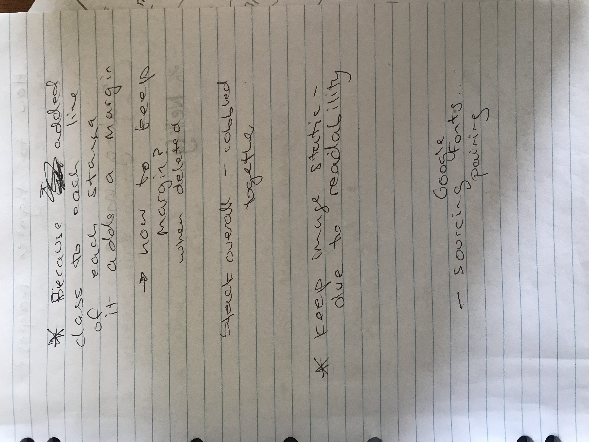
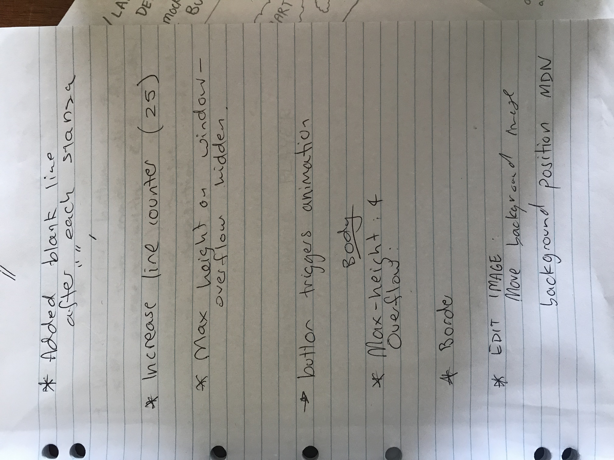
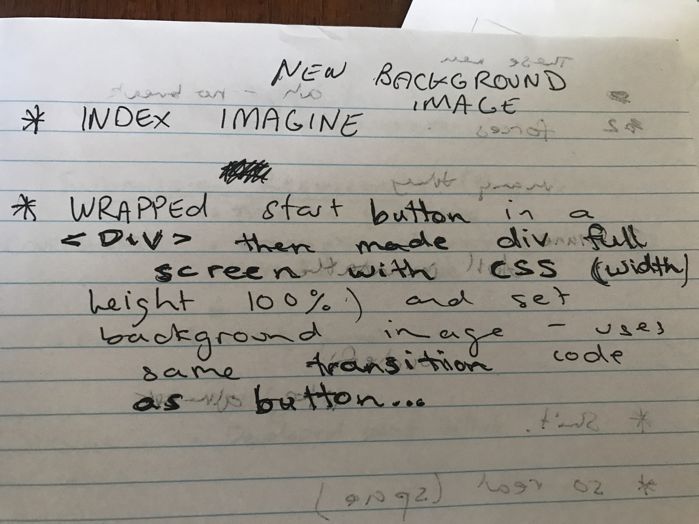

### Developing the audio

In order to make the audio component (voice over & backing track & sound effects) I used the digital audio application (Reaper)[https://www.reaper.fm/] which is free and intuitive, as opposed to similar programs. I used my friend's small home studio, which is equiped with a  to record with a Rode procaster, a condenser microphone; these mics are designed to pick up voice only (or the closest noise), cancelling out background noise. Having practiced the poem several times, I was able to get a single, consistent vocal recording without the need to cut new vocals in etc. The vocals then only required a light edit, mostly elminating out background noise (paper shuffling etc.).

I then sourced the backing-track/music online at.        I felt some musical accompanyment was the best option as the poem is considerably long, and I was worried that viewers/readers might lose interest. I specifically wanted music that enhanced the vocal without overpowering them; I wanted music that would give the piece a sense of scale and atmosphere, and tonally align with the work. Sourcing the right track took considerable time as I wanted it to be outside copyright (so I can later exhibit the work) but also to be relatively neutral. A lot of free music is designed with film in mind so is overtly dramatic, using minor and major cords; tonally, neither happy nor sad would work for my piece. I eventually settled on a guitar/drum track that harks back to 90s working class steel rock. I then edited the music to meet the cadences and rythmns of the vocals, lowering the music at parts to enhance what is being said. I also enhanced/edited the drum beat at times to give particular phrases/sections gravity. 

Simiarly, I then sourced sound effects from the BBC sound archives. I played around with these effects and their placement considering how they might aesthically and tonally enhace the work, or detract from it. I was concerned, at times, that particular sound effects might make the work corny, so ended up settling on a relatively minimalist approach. I changed sound settings throughout concious of where I thought the listener/viewer might start to lose interest in the piece. 

#### Reflections on audio development

I'm forunate that I had access to good recording equipment, as dodgy equipment would have made the process considerably more difficult. Initially i planned to use garage band to develop the audio but on my friend's advice, I settled on Reaper; in hindsight this was wise as Reaper is quite intuitive and very easy to use. I'm keen to hear people's feedback on the audio itself, as I feel it really enhances the work; I am, slightly worried, however, that there's a lot going on on-screen. 

### Reflections on images during development

I decided during development not to include multiple 'fading' background images. As other students have raised, this could be quite distracting and actually detract from the overall work. It may have also raised readability issues. Inserting the audio, as well, made me think more specifically about this issue. In drafting/programming stages, I realised a stactic background image was effective anyway. I felt, however, a fade at the start of the poem (before the audio begins) paid homage to this initial idea and created early audience interest. 

Similarly, during production, I realised having 'fading' or 'holographic' text that responded to the cursor would have overwhelmed the reader/viewer, so I ended up abandoning this idea for text that simply 'unfurled' upwards. 

#### Reflection on major challenges

##### Syncing the timing

Initially my plan was to use a timer function on howler.js to sync the audo, visual and text components. Over the course of the project however, and while experimenting with time-tagged text, I became concerned that a tagged time function may make the text 'appear' jagged, disorientating the reader in the presentation of the poem. By experimenting with line spacing instead of time tagging (an idea that came to me while inserting stanza breaks), I resolved this issue. While the text and audio are not perfectly synced, they are close enough to appear aligned; this was fortunate, and likely related to the rythmns in which I read the poem (indicated, somewhat, already by the line-breaks and stanza spacing). This process, too, while time intensive (having to listen to the poem hundreds of times to insert line breaks appropriately) may have saved me some time overall. 

##### Poem content

Weeks into development, I realised that part of the poem I planned to use had already been submitted for an earlier assignment, which meant i was unable to include this poem in full. Fortunately, as the original poem 'at the end of the rail' explores reoccuring themes throughout my work, I managed to find another poem that conceptually and stylistically aligned to where my project already was. This required, however, a format conversation and singificant text and shape changes to meet the existing layout. 

#### Programming the page transition/start button/audio start 

I had some trouble animating the transition between the holding page and poem page. I had set up a CSS animation that would play on a CSS class but struggled to find how to add a class when the button event fired. For most of my cording problems I googled what I was trying to achieve and then used MDN to gain a bit more insight into what was suggested. In this case, a forum suggested I use a classList in Javascript to add a class, so I sourced an example on the classList MDN PAGE: https://developer.mozilla.org/en-US/docs/Web/API/Element/classList. Effectively, I added a class to the <body> HTML tag in the function that was fired from clicking the button. The animation I set up using CSS would fade the landing page out over time, so when the class was applied to a HTML tag it would fade that tag out. Likewise, the audio is also triggered when the start button is activated, with a specific time delay function that I found on MDN.  

## Feedback on final project development

### Ruby's Feedback (dated 24/5/2022)

'Hi Tim, 

Thank you for sending me through your wonderful poem (and for giving me feedback on my poem)!

I think it’s a powerful, atmospheric and well-executed piece. So many lines stuck out to me, e.g. ’hands line obliterators’, ‘ironclad centipede’, ‘idiocy of dreams’, ‘their shapes glorious stitch lines in the fabric of all else’, ‘mother, secret keeper’, ‘the glue factory is coming’ (!) — and also more subtle elements, like the double (aural) implication of ‘men of lore’ (law) that a reader likely wouldn’t pick up on if the poem wasn’t being read aloud. The alignment of the audio elements (reading + music + sound effects) works well on both a technical and a poetic level. I also enjoyed the way that the thematic through-line (ha!) of the text carried effortlessly into the website’s imagery and audio. 

When you first showed me a short excerpt I was worried that the backing track might overpower your voice and the content of the poem, but after listening to it in full I think it enhances the aesthetic and message of the work — it really adds to the dark, cinematic tone. I can definitely see this piece being projected on a bigger scale, e.g. in a gallery space. 

My only concern was whether the entry button could have more design to it, to match the rest of the website — it looks a bit plain. Other than that, I think this piece is ready for the world! 

Best, 
Ruby'

### Benjamin's Feedback (for pitch assessment but applied later)

'Hi Tim, This is an excellent idea for a poem, and you’ve got a very clear idea of what you want to achieve. It sounds like it will be a powerful immersive work. You may also think about different versions of this, possibly something presented in a physical space such as a gallery. As you progress with the technical aspects, it might be helpful to sketch out/diagram how you expect the digital aspects to work and to prototype each element slowly. Be careful not to overwhelm yourself with too many technical jobs/skills. Getting the timing right may end up being a manual process. With something like howler.js, it might be easier to cut up the poem and sync each smaller section. Always look at a library that can assist you rather than coding from scratch. It is also fine to get technical help from people outside the course, or we can address any of your issues in class. Benjamin'

In person, Benjamin also expressed some reservations about the audio overpowering the text; he stated however, this may be due to vantage point and scale and would offer further feedback at a later date. 

### Other Feedback

I showed my project to a few friends and colleauges and asked for general feedback. 

#### general positive feedback: 
- liked the syncing of audio and visual
- found the poem lyrically satisfying
- enjoyed the narrative base
- felt the use of images enhanced the work
- felt the poem was intuitive to read
- felt it wasn't too concept dense
- felt the work captured a very particular tone e.g. nostalgic australiana 
- felt the poem was overall satisfying

#### general critical feedback:
- wondered whether the fade between images could be slowed
- wondered if the entry button could be re-designed
- wondered whether the poem should automatically refreshed
- curious about length in terms of assignment 

## Response/reflection on final round of feedback

Evidently, my major concerns at this point are about redesigning the entry button/point. I think I'll lower its opacity, perhaps round the edges and make it a bit larger, as well as potentially change the font. I'll also play around with the opacity/fade between the first images, as I'm not quite sure it's right yet. I want it to perfectly land in terms of timing between start of text, audio and imagery. 

Issues in terms of audio syncing have been resolved , as outlined above, which is grand. Again, I'd rally love to see the work in a gallery space, as it was designed for that. 

In terms of re-freshing, I've canvased opinions and largely people seem to think that ending on the image is more conclusive rather than the refresh. I tend to agree, however, might play around and see what can be done (though I'm told technically this might be quite difficult).

## Final changes/towards submission

Having redeigned the 'start' button,  tweaking the opacity/fade for the images and double checking the audio/text relationship, I'm satisified that the project is now complete, and ready for submission. 

Overall, I feel that the project is also reading to be submitted to journals, and could work in a larger gallery space with projectiong mapping and speakers. I now plan to seek avenues for publication and exhibition, and will in due course link the work directly to my website so that I can do it to pitch for future projects. 

